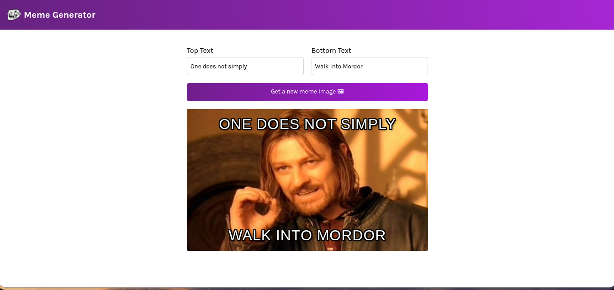

# Meme Generator 🖼️

A fun and simple web application built with React that allows you to create your own memes. Choose from a vast library of popular meme templates, add your custom top and bottom text, and generate a new meme with the click of a button!



## ✨ Features

-   **Dynamic Text:** Add and update top and bottom text on the meme image in real-time.
-   **Random Meme Images:** Fetch a new random meme template from the [Imgflip API](https://api.imgflip.com/).
-   **Responsive Design:** A clean and simple interface that works well on different screen sizes.
-   **Modern Tech Stack:** Built with modern web technologies including React and Vite.

## 🛠️ Technologies Used

-   [React](https://reactjs.org/)
-   [Vite](https://vitejs.dev/)
-   JavaScript (ES6+)
-   CSS3
-   HTML5
-   [Imgflip API](https://api.imgflip.com/) for meme templates.

## 🚀 Getting Started

To get a local copy up and running, follow these simple steps.

### Prerequisites

Make sure you have [Node.js](https://nodejs.org/) and [npm](https://www.npmjs.com/) installed on your machine.

### Installation

1.  Clone the repo:
    ```sh
    git clone https://github.com/0xYurii/Meme-Menerator.git
    ```
2.  Navigate to the project directory and install dependencies:
    ```sh
    cd meme-generator
    npm install
    ```
3.  Run the development server:
    ```sh
    npm run dev
    ```

Open your browser and navigate to the local URL provided in your terminal to see the application live!